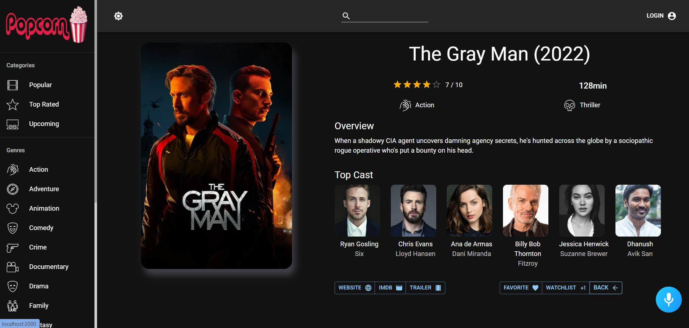
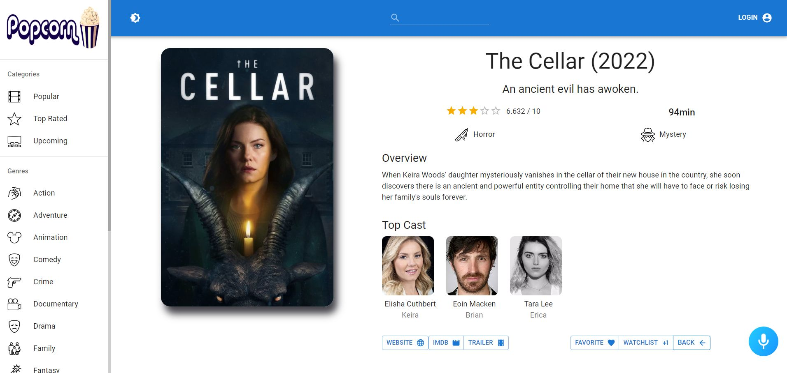

<p align="center">
    <a href="https://popcorn-movie-app-plum.vercel.app/" target="_blank">
      
    </a>
  </p>

# Preview
### `Dark Mode`

### `Light Mode`


# Popcorn Movie App Features
- **1) Artificial intelligence voice assistant**: Hit on the Button at the bottom-right of the page, then ask Alan (The Robot) any of the following command, and Alan will do it for you
```
 👉 "What does this app do?" | "What can I do here?" | "What is this app about?"
 👉 "Search for Spiderman"    ("Search for + any movie name")
 👉 "Make it dark" | "Make it light"
 👉 "Login" | "Logout"
 👉 "Go to Action, Adventure, Animation, Comedy, Crime, Documentary, Drama, Family, Fantasy, History, Horror, Music, Mystery, Romance, Science Fiction, TV Movie, Thriller, War, Western"
 👉 "Give me something funny." | "I want to laugh."
 👉 "Surprise me!"
```

-  **2) Light and Dark Modes**

-  **3) Authentication**

-  **4) Search Engine for fetching any movie, viewing movie and actor details, adding a movie to favorites or watchlist and many more functionalities**

-  **5) Sort movie on the basis of categories or genres**

# Tools used in this App:
#### `React.js | Redux & Redux Toolkit | RTK Query | Axios Library | Material-UI Library`